# Furkan Yanteri

**Founder of ObliqueX Global. Product manager and full stack engineer, at the same time.**

I write the roadmap and then I write the code. Frontend, backend, mobile, LLM integration, the database underneath and the deploy pipeline around it, plus the client conversations in between. Five years of that in global enterprise environments, now running my own software studio alongside product work.

---

## ObliqueX Global

My software studio. It does two things at once: it builds and operates its own products, and it delivers custom software for companies that need something specific built properly. I own the whole line, from the first client call to the production deploy and whatever breaks after it.

Active markets: Germany, United Kingdom, United Arab Emirates, Australia, Turkey.

| Product | What it is | Status |
|---|---|---|
| [GoalT](https://goalt.org) | Open source goal graph engine for prioritization, shipped as a Claude Code plugin | Published on PyPI, Apache 2.0 |
| [Furkan Interior](https://furkaninterior.com) | Booking and operations platform for a commercial cleaning and renovation business | Live, serving real customers |
| Video Speeder | Canva app that speeds up video beyond the platform's native limit, up to 50x | In Canva app review |
| [Otopact](https://otopact.com) | Two sided platform connecting vehicle owners with authorized service providers | In development, first markets targeted for Q1 2027 |
| [KelimeYap](https://obliquex.com/apps/kelimeyap) | iOS and Android word game family, React Native and Expo on Supabase | In development |

Client work covers web and mobile platforms, AI driven business automation, digital signage systems, and internal planning and workflow software. The current engagement is a global sales refactor for a United States based street furniture manufacturer, described below.

---

## Open source: GoalT

Most prioritization tools assume a clean hierarchy. One goal breaks into sub goals, those break down further, and the shape stays a tree. Real work does not behave that way. A single fix often serves three different initiatives for three different reasons, and a tree cannot express that.

GoalT models goals as a directed acyclic graph. Every parent distributes exactly 1.0 of value across its children, and a goal with multiple parents accumulates value from each of them. Work that genuinely matters to more parts of a project rises to the top on its own, without anyone assigning it a priority number by hand.

- Published on PyPI: `pip install goaltree`
- Listed in the official Model Context Protocol registry as `io.github.furkanYanteri1/goaltree`
- Ships as a Claude Code plugin: an MCP server plus a live dashboard that shows which goal the agent is working on right now
- Value redistribution is pluggable. The default split is deterministic and needs no API key. An LLM can decide the weights instead, and whatever it returns is validated and renormalized, so the graph stays mathematically consistent even when the model returns something odd
- Apache 2.0, with tests covering the engine, the MCP server and the dashboard
- Runnable Colab notebook, so it can be tried without installing anything

Repository: **[GOAL-T/goaltree](https://github.com/GOAL-T/goaltree)**, under the [GOAL-T](https://github.com/GOAL-T) organization, which I run.

The project is at concept stage and deliberately open to challenge. If the value propagation model looks wrong to you, that is exactly the feedback it needs: open a [discussion](https://github.com/GOAL-T/goaltree/discussions), file an [issue](https://github.com/GOAL-T/goaltree/issues), or read [CONTRIBUTING.md](https://github.com/GOAL-T/goaltree/blob/main/CONTRIBUTING.md) first. Trying it takes one click through the Colab notebook, no install required.

Also on npm: **[mock-quick](https://www.npmjs.com/package/mock-quick)**, a small schema based mock data generator for JavaScript.

---

## Selected work

### Avfortis

Live on the [App Store](https://apps.apple.com/tr/app/avfortis/id6758888389) and [Google Play](https://play.google.com/store/apps/details?id=com.avfortis), at [avfortis.com](https://www.avfortis.com). A Cloudit product, and the one I run as Technical Product Owner: strategy, roadmap, release planning and the code itself.

Avfortis is a professional system for practicing lawyers in Turkey. Its core is tevkil, the arrangement where one attorney delegates a hearing or a procedural step to a colleague in another city. The app turns that into a managed flow organized by province, district and courthouse, so an attorney can find and instruct a verified colleague at the right courthouse instead of working the phone. Around it sits the rest of the professional layer: colleague search, direct messaging and live chat, forums, article publishing, job and office listings, and a digital profile.

Membership is closed by design. Every account is verified against active bar registration, because none of it works unless the person on the other side is genuinely an attorney. The domain sits under the Turkish Attorneys Act (Avukatlık Kanunu no. 1136), with the professional secrecy duty it imposes, and under the personal data protection law (KVKK no. 6698). Verification, messaging and data retention were designed around those rules rather than retrofitted to them, which is the part that shapes most of the architecture.

Shipped in May 2026 and iterating since, currently on 1.0.15, with AI features in development. Closed source.

### Urbana, a dealer catalog for street furniture

Working prototype: **[squadz.space](https://squadz.space)**

Part of a wider engagement with a United States based street furniture manufacturer: a full refactor of how they sell globally, sales strategy included, not only the software that carries it.

The prototype is a dual audience catalog. Customers browse and configure, dealers get their own view of the same fifty product range across play structures, benches and seating, fitness stations and shade structures. Each product page carries a configurator for color and finish, a 3D model viewer, technical specifications down to the compliance standard the item is built to, and inquiry routing straight into WhatsApp or email so a lead never has to be retyped.

The part that matters commercially is "See It In Your Space": the customer uploads a photo of their actual site and sees the product placed into it. Selling large outdoor equipment fails at exactly that step, the buyer cannot picture it in the real location, and no amount of studio photography fixes that.

Next.js, React and TypeScript on Tailwind, server rendered, deployed on Vercel. In active development, so the source stays private.

### Video Speeder, a Canva app

Canva caps video playback speed at 2x. Video Speeder lets a user pick a video already sitting on their canvas, speed it up to 50x, and get the processed result back in place. Built solo, full stack: React and TypeScript on Canva's Apps SDK and App UI Kit, a Node.js and Express backend running native FFmpeg, containerized with Docker.

The interesting parts were the constraints:

- Canva's content security policy blocks Web Workers outright, which rules out in browser processing with ffmpeg.wasm. That finding forced a full architecture pivot to server side processing.
- Output files have to fit inside platform storage limits, so the backend derives the bitrate from clip duration and target speed and guarantees the size before encoding starts, rather than encoding first and hoping.
- Canva's asset API could return a `blob:` reference that looks valid but is not yet usable, because the video was still being registered on their backend. That race showed up as a confusing failure, so it is now a retry with real feedback to the user.
- Encoding parameters were tuned to finish reliably inside free tier compute limits, which is what stopped larger files from timing out.
- Internationalized with Canva's app i18n kit and react-intl.

Currently in Canva's review queue, at the design review stage.

### Furkan Interior

A production web platform for a commercial cleaning and renovation business in Ankara: service catalog, booking flow, customer content and an admin side, in Turkish. React and TypeScript with Supabase behind it, plus Three.js and an LLM integration on the content side. Around 480 commits, live at [furkaninterior.com](https://furkaninterior.com) and used by real customers rather than sitting in a portfolio.

### KelimeYap

A word game family for iOS and Android, React Native and Expo on Supabase, monetized through ads plus an ad free subscription. Roughly 900 files and 370 commits so far. In development, English release planned.

---

## Background

### Cloudit
**Software Product Manager. January 2025 to present. London, United Kingdom.**

Managing end to end development of a software product with three sub products, from ideation to MVP, and acting as Technical Product Owner on Avfortis, described above. Market research, stakeholder alignment, roadmap and delivery, staying close to QA, UAT and API testing rather than handing specs over the wall. Prioritizing under real ambiguity while keeping delivery velocity intact. Day to day across BlackBoard, Miro, Notion, Jira, Figma, Mixpanel and SurveyMonkey on the product side, and Vue.js, Pinia, MongoDB, Node.js, Express, Firebase, S3, JWT, WebSockets, Elasticsearch and GitHub Actions on the technical side.

### Pitcher AG
**Frontend Developer, then Software Engineer and Technical Project Manager. June 2021 to June 2024. Ankara, Turkey.**

Pitcher is a global sales enablement platform used by enterprise clients including Johnson & Johnson and Novartis. I spent three years there and moved into technical project management in 2024 without leaving the codebase behind.

*Engineering:* built user interfaces and backend systems across Vue.js, JavaScript and ES6, PHP, MySQL and SQLite. Built reusable component libraries on Vuetify and internal design systems. Maintained REST and GraphQL integrations, including Salesforce. Cut load times by up to 40 percent through frontend and data layer work. Refactored legacy jQuery and vanilla JS that was still carrying production traffic. Ran zero downtime releases and set up CI/CD on GitHub Actions.

*Project and product:* ran sprint planning, backlog refinement and stakeholder reviews. Acted as escalation point for Tier 2 and Tier 3 production incidents, owning root cause analysis and SLA response. Led API driven implementation projects with third party developers, coordinated releases across distributed teams, and ran A/B tests to settle product arguments with data instead of opinion.

### BITES Defence and Aerospace Technologies
**Intern Computer Engineer. 2020. Ankara, Turkey.**

Applied deep learning to image classification and object detection.

---

## Both roles, not one after the other

Most people pick a side. I did not. I write the roadmap and then I write the code, and I keep both sharp because they feed each other: knowing what a feature actually costs to build changes how I scope it, and sitting in the client meeting changes what I build.

A normal week can be a sprint plan on Monday, an FFmpeg encoding timeout on Tuesday, a Postgres schema on Wednesday, and a client demo on Thursday.

---

## Engineering, layer by layer

**Frontend.** Vue.js in enterprise production at Pitcher, including reusable component libraries on Vuetify and an internal design system used across the product. React and TypeScript since then, on Vite and Next.js, with Tailwind and shadcn. Three.js when a page needs real 3D. Performance counts as part of the job rather than a later ticket: up to 40 percent faster load times at Pitcher through frontend and data layer work.

**Backend and APIs.** Node.js and Express services, PHP and MySQL on legacy systems still carrying production traffic, Python for the GoalT engine. REST and GraphQL integrations including Salesforce. JWT and OAuth2 for auth, WebSockets where the product needs to be live. The Video Speeder backend runs native FFmpeg inside Docker and derives output bitrate from clip duration and target speed, so the result is guaranteed to fit the platform's storage limit before encoding even starts.

**Mobile.** React Native and Expo on KelimeYap, roughly 900 files, Supabase behind it and an ads plus subscription model on top. Native iOS in Swift and SwiftUI, native Android in Java. Cross platform when that is the right call, native when it is not.

**LLM and AI integration.** More than calling an API with a prompt. GoalT ships an MCP server listed in the official Model Context Protocol registry, plus a Claude Code plugin with hooks and a live dashboard. Its value redistribution layer can hand weighting decisions to an LLM, then validates and renormalizes whatever comes back, so a bad model response cannot corrupt the graph. Anthropic SDK running in production on the Furkan Interior platform. Before all of that, deep learning for image classification and object detection during the BITES internship, with Keras and TensorFlow certification behind it.

**Data.** PostgreSQL through Supabase on most current products, with row level security and auth wired in properly rather than bolted on. MongoDB, MySQL, SQLite and Elasticsearch from earlier work. Schema design driven by how the product actually gets queried, not by how it looks in a diagram.

**Infrastructure and delivery.** Docker, Render, Vercel, AWS. CI/CD on GitHub Actions. Zero downtime production releases at Pitcher, alongside Tier 2 and Tier 3 incident escalation, root cause analysis and SLA response. ESLint, Prettier, Jest and Vitest, and a test suite on GoalT covering the engine, the MCP server and the dashboard.

---

## Product, the other half

Roadmaps that survive contact with engineering. Discovery and scoping with the people who will actually use the thing. Backlog prioritization when everything is urgent. Agile ceremonies that produce decisions rather than status updates. A/B testing and experiment design instead of arguing from opinion. Enterprise stakeholder management, briefings and demos, including standing in front of the client during a production incident. Delivery ownership through release and post launch iteration.

Three sub products from ideation to MVP at Cloudit. Sprint planning, backlog refinement and stakeholder reviews at Pitcher, plus the escalation seat when something broke. At ObliqueX the roadmap and the commits are both mine.

---

## Tech

| Area | Tools |
|---|---|
| Frontend | Vue.js, React, Next.js, TypeScript, JavaScript, Vite, Vuetify, Tailwind, shadcn, Three.js, Sass |
| Backend and APIs | Node.js, Express, PHP, Python, REST, GraphQL, WebSockets, FFmpeg, JWT, OAuth2 |
| Data | PostgreSQL, Supabase, MongoDB, MySQL, SQLite, Elasticsearch |
| Mobile | React Native, Expo, iOS (Swift, SwiftUI), Android (Java) |
| AI and LLM | Claude API, OpenAI API, Model Context Protocol, MCP server development, Keras, TensorFlow, n8n, Zapier |
| DevOps and quality | Git, GitHub Actions, CI/CD, Docker, AWS, Vercel, Render, ESLint, Prettier, Jest, Vitest, pytest |
| Product and delivery | Agile and Scrum, Jira, Confluence, Notion, Figma, Miro, Mixpanel, roadmapping, A/B testing |

---

## Education

**Sakarya University**, Bachelor of Engineering, Computer Engineering.
**Gebze Technical University**, Computer Engineering.

---

## Certifications

Every entry below links to its issuer's verification page, and so does its thumbnail.

**Product, project and business**

| Preview | Certificate | Issuer |
|---|---|---|
| <a href="https://www.coursera.org/account/accomplishments/verify/AUXFV5W9MSOQ">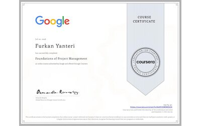</a> | [Foundations of Project Management](https://www.coursera.org/account/accomplishments/verify/AUXFV5W9MSOQ) |  Google |
|  | [Foundations of Account Management](https://www.coursera.org/account/accomplishments/verify/G827L3CDUN9N) |  Microsoft |
|  | [Grow as a Manager](https://www.coursera.org/account/accomplishments/verify/TB7KPNJHAH4U) |  Google |
| <a href="https://www.coursera.org/account/accomplishments/verify/C5G52ZG7GC2M">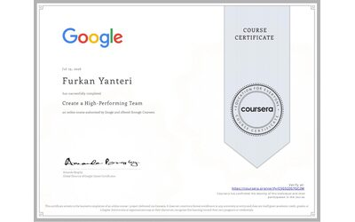</a> | [Create a High Performing Team](https://www.coursera.org/account/accomplishments/verify/C5G52ZG7GC2M) |  Google |
| <a href="https://www.coursera.org/account/accomplishments/verify/2679KOD5EQT2">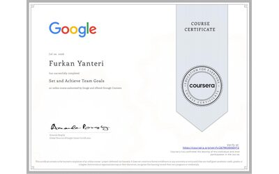</a> | [Set and Achieve Team Goals](https://www.coursera.org/account/accomplishments/verify/2679KOD5EQT2) |  Google |
| <a href="https://www.coursera.org/account/accomplishments/verify/3L8LX9ECJSYT">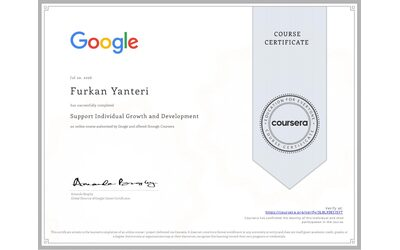</a> | [Support Individual Growth and Development](https://www.coursera.org/account/accomplishments/verify/3L8LX9ECJSYT) |  Google |
|  | [Google People Management Essentials](https://www.credly.com/badges/504fa197-abaf-422b-9577-06fe0c41b027/linked_in_profile) |  Google |
| <a href="https://www.udemy.com/certificate/UC-2df57136-be4d-4be5-bdf9-4b78bde610fc/">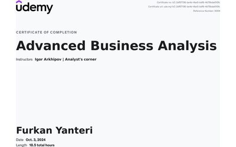</a> | [Advanced Business Analysis, CBAP](https://www.udemy.com/certificate/UC-2df57136-be4d-4be5-bdf9-4b78bde610fc/) |  Udemy, Igor Arkhipov |
| <a href="https://www.udemy.com/certificate/UC-6389f01d-6f45-4062-9754-126b0eb5851f/">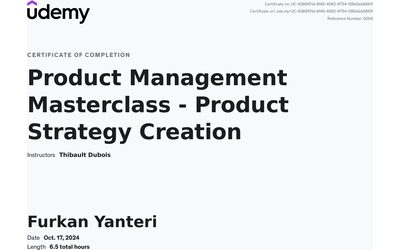</a> | [Product Management Masterclass](https://www.udemy.com/certificate/UC-6389f01d-6f45-4062-9754-126b0eb5851f/) |  Udemy |
| <a href="https://www.udemy.com/certificate/UC-235bb739-ad8b-44e9-af56-1860209cd4a9/">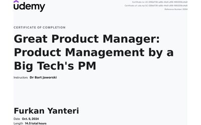</a> | [Product Management by a Big Tech PM](https://www.udemy.com/certificate/UC-235bb739-ad8b-44e9-af56-1860209cd4a9/) |  Udemy, Dr Bart Jaworski |
| <a href="https://www.udemy.com/certificate/UC-f1d0d075-10e2-4c2b-84c2-fe61f3c3a609/">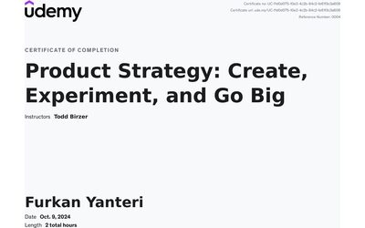</a> | [Product Strategy](https://www.udemy.com/certificate/UC-f1d0d075-10e2-4c2b-84c2-fe61f3c3a609/) |  Udemy, Todd Birzer |

**Engineering, data and AI**

| Preview | Certificate | Issuer |
|---|---|---|
| <a href="https://www.coursera.org/account/accomplishments/verify/D2OLJBDPE0TX">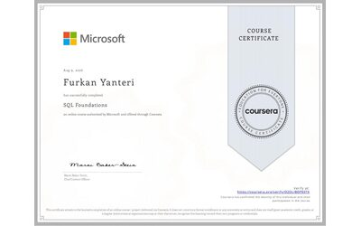</a> | [SQL Foundations](https://www.coursera.org/account/accomplishments/verify/D2OLJBDPE0TX) |  Microsoft |
| <a href="https://www.coursera.org/account/accomplishments/verify/1H2WOFIHLDOP">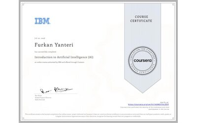</a> | [Introduction to Artificial Intelligence](https://www.coursera.org/account/accomplishments/verify/1H2WOFIHLDOP) |  |
| <a href="https://www.udemy.com/certificate/UC-88106e34-77e0-4cde-b44e-22e22deba4a4/">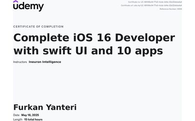</a> | [Complete iOS 16 Development with SwiftUI](https://www.udemy.com/certificate/UC-88106e34-77e0-4cde-b44e-22e22deba4a4/) |  Udemy |
| <a href="https://www.udemy.com/certificate/UC-d1472294-8283-4077-9274-2960eec38a7f/">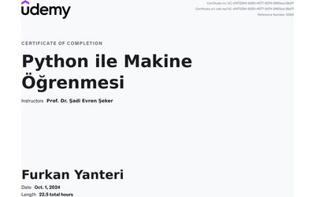</a> | [Machine Learning with Python](https://www.udemy.com/certificate/UC-d1472294-8283-4077-9274-2960eec38a7f/) |  Udemy |
| <a href="https://www.udemy.com/certificate/UC-9598144a-a133-4e52-bd8a-b844f6790c53/">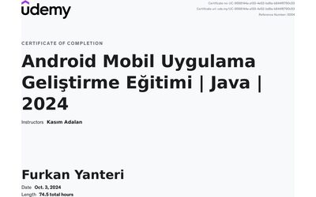</a> | [Android Development with Java](https://www.udemy.com/certificate/UC-9598144a-a133-4e52-bd8a-b844f6790c53/) |  Udemy |
| <a href="https://www.coursera.org/account/accomplishments/verify/EDLMK92DY4NK">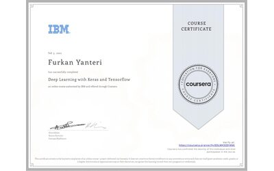</a> | [Deep Learning with Keras and TensorFlow](https://www.coursera.org/account/accomplishments/verify/EDLMK92DY4NK) |  |
| <a href="https://www.udemy.com/certificate/UC-8df52b6a-5b1b-4ab2-ac78-e63ab98467a8/">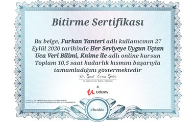</a> | [End to End Data Science with KNIME](https://www.udemy.com/certificate/UC-8df52b6a-5b1b-4ab2-ac78-e63ab98467a8/) |  Udemy |
| <a href="https://www.udemy.com/certificate/UC-aafb52c9-40d3-4114-90be-f8177fd66ee8/">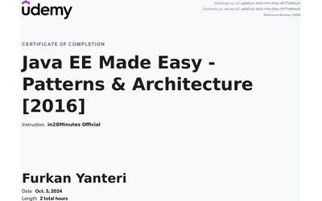</a> | [Java EE Patterns and Architecture](https://www.udemy.com/certificate/UC-aafb52c9-40d3-4114-90be-f8177fd66ee8/) |  Udemy |

---

## Contact

Open to conversations about B2B product work, AI product management, and anything built on the Model Context Protocol.

- **Web:** [obliquex.com](https://www.obliquex.com)
- **LinkedIn:** [furkan-yanteri](https://linkedin.com/in/furkan-yanteri)
- **Email:** [furkanyanteri@gmail.com](mailto:furkanyanteri@gmail.com)
- **Instagram:** [@devtriessomeshit](https://instagram.com/devtriessomeshit)
